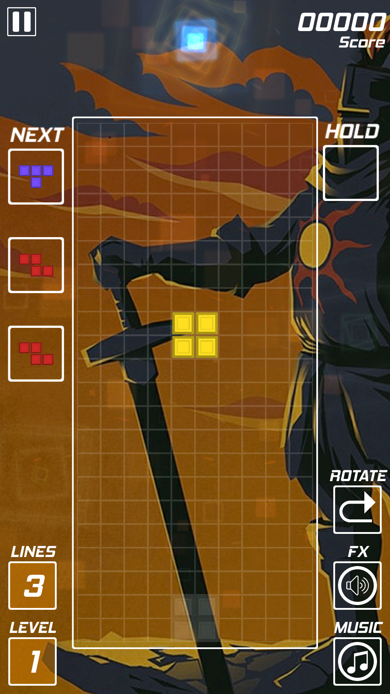
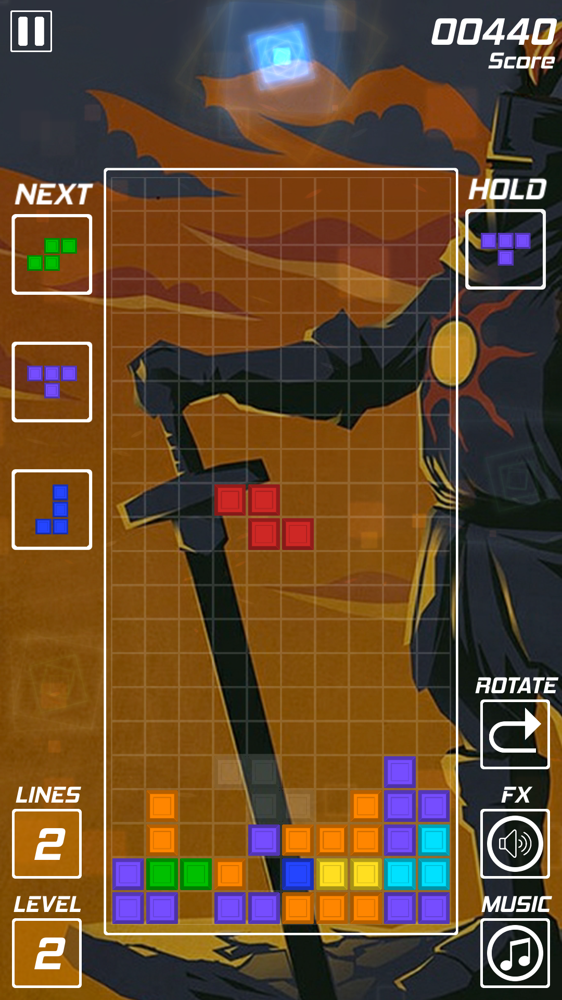
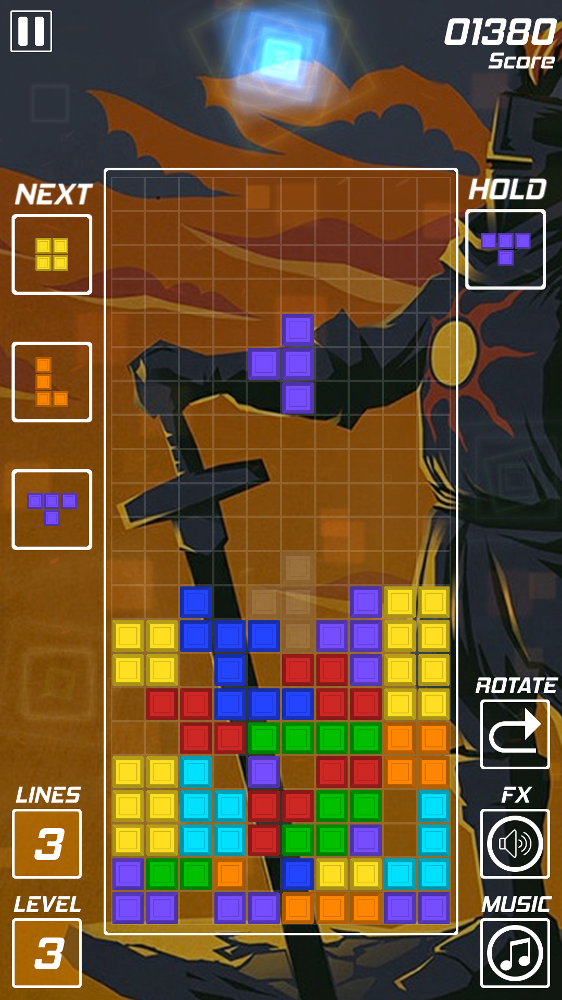
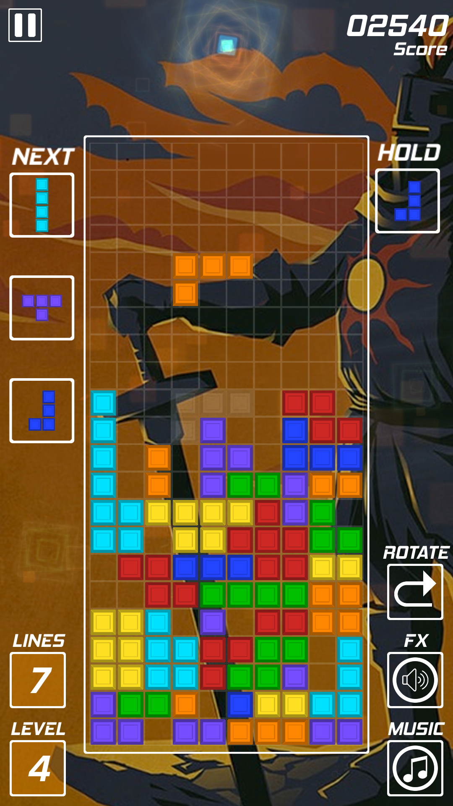
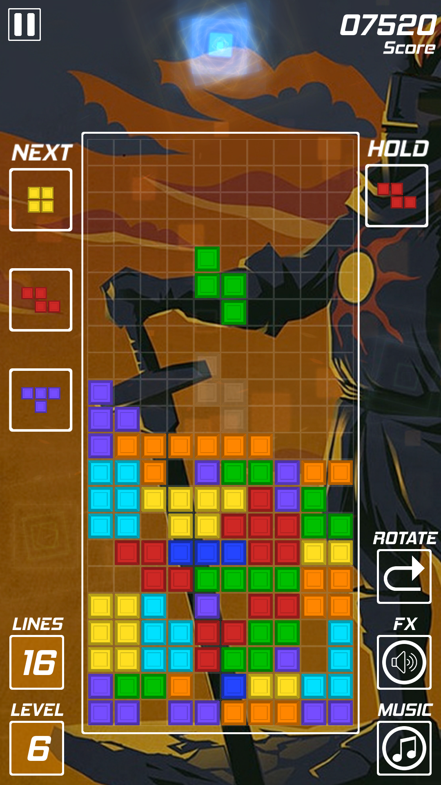

# Solaire Tetris

 

A tetris-style puzzler in Unity created under Wilmer Lin's [course](https://www.udemy.com/course/make-a-tetris-style-puzzler-in-unity/).

## Controls

### PC

 - **Arrow left/right or A/D** - move piece to the left/right
 - **Arrow down/S** - move piece down
 - **Arrow up/W** - rotate piece
 - **R** - change rotation direction
 - **C** - to catch/release a piece in hold case
 - **Esc** - pause/unpause game

### Mobile

 - **Swipe left/right** - move piece to the left/right
 - **Swipe down/swipe down & hold** - move piece down
 - **Swipe up/tap** - rotate piece

## Else

 - Toogle music off and on to change music track.

## Screenshots

## Gameplay

## Credits

Used music:
 - Pegboard Nerds & Tristam - Razor sharp (Intro)
 - 8-Bit Universe - Immortals (8-Bit Version)
 - Open Hexagon - Let's Increment
 - Groove Addicts - Conviction
 - Jack Russel - Pointless
